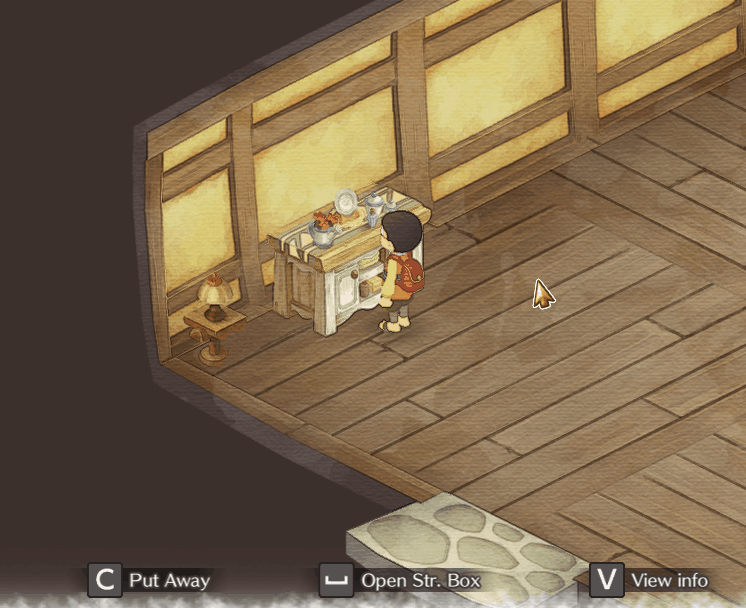

# Easy boards

<!-- nexus-disable -->

	

<!-- nexus-enable -->
<!-- nexus-only
[center][img]@@@RawRepositoryURL@@@/docs/modImages/EasyBoards.gif[/img][/center]
-->

A plugin that allows you to quickly access few menus from any "Chest" furniture in your house.

The following menus are acessible from it:
- Ledger
- Bulletin board (The big board at the city)
- Gallery
- Guidebooks
  - Bugs
  - Crops
  - Fish
  - Recipes

<!-- nexus-disable -->

**Table of Contents:**
- [Installation](#installation)
- [Building](#building)
- [Found an issue?](#found-an-issue)
- [Contributting](#contributting)

<!-- nexus-enable -->

## Installation
**Requirements:**
You must have BepInEx v5 installed on your game.
- [Download BepInEx v5](https://github.com/BepInEx/BepInEx/releases)
	- [How to install BepInEx](https://docs.bepinex.dev/articles/user_guide/installation/index.html)

<!-- nexus-disable -->
After having them installed:
1. download the latest version of the mod files from [Releases](https://github.com/guilherme-gm/KirieZ_DoraemonSoSMods/releases) page and extract it somewhere
2. Copy the `EasyBoards` dll file into your game's `BepInEx/plugins/` folder
3. Start the game

<!-- nexus-enable -->
<!-- nexus-only
After having them installed:
[list=1]
[*] download the latest version of the mod from Files tab and extract it somewhere
[*] Copy the "EasyBoards" dll file into your game&#39;s  [font=Courier New][color=#ffff00]BepInEx/plugins/[/color][/font]  folder
[*] Start the game
[/list]
-->
---

<!-- nexus-disable -->
---
## Building
You will need Visual Studio 2019 and .NET Framework 3.5 installed.

1. Clone this repository
2. Copy Doraemon's `Assembly-CSharp.dll` into `libs` folder
3. Open the `Mods.sln` solution
4. Build it

<!-- nexus-enable -->
---

## Found an issue?
If you have found any issue or have questions about it, feel free to open an issue in the [GitHub repository](https://github.com/guilherme-gm/KirieZ_DoraemonSoSMods/issues).

<!--nexus-only
You may also message on the mod board here in Nexus and I will check sometime.
-->

---

## Contributting
See [CONTRIBUTTING.md](../CONTRIBUTTING.md).
