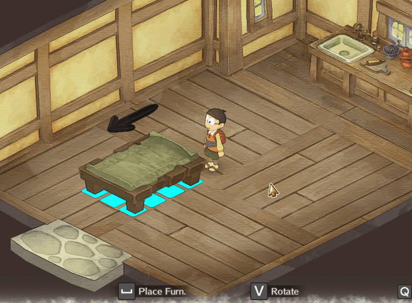

# Enhancements and Tweaks
A mod containing several additions and tweaks to the game. It aims at improving the game experience (per mod-author own perspective).

All of its changes are configurable, so you may enable only the ones you want and even enabling them may allow you to further
customize it to your desires.

**Table of Contents:**
- [Installation](#installation)
- [Change list](#change-list)
	- [Adjust Tool Stamina](#adjust-tool-stamina)
		- [Reasoning](#reasoning)
		- [Configs](#configs)
	- [Alternative Furniture Rotation](#alternative-furniture-rotation)
		- [Configs](#configs-1)
- [Configuration](#configuration)
- [Building](#building)
- [Contributting](#contributting)

## Installation
You must have BepInEx v5 installed on your game.
- [Download BepInEx v5](https://github.com/BepInEx/BepInEx/releases)
- [How to install BepInEx](https://docs.bepinex.dev/articles/user_guide/installation/index.html)

After having it installed:
1. download the latest version of the mod dll from the [Releases](https://github.com/guilherme-gm/KirieZ_DoraemonSoSMods/releases) page
2. Extract its content into your game's `BepInEx/plugins/` folder
3. Start the game
4. **(Optional)** If you don't want to use the default settings, close the game and see [Configuration](#configuration)

## Change list

### Adjust Tool Stamina
Makes every tool that consumes stamina always use 1, whatever the charge level is.

#### Reasoning
In the original game, improving the tool doesn't help much because although they cover a larger area,
the stamina consumption is the same as if you have used it several times. Thus, you just run out of stamina faster.

One could say this gives you more time for doing power naps, but in this case you just have to use technique endlessly
instead of enjoying the game. OR, if possible, you have to rush some gadget that does the work for you.

By making every charge level consume 1 stamina, you may aim at upgrading the tools you are using the most so
you spend less stamina doing your everyday stuff, having stamina for the rest of the day to do more.

Note that this change made Silver upgrade a bit weird, because it just charges faster. I did not touch it,
and just consider it as a "I can finish my work faster" upgrade.

#### Configs
| Config Name | Description        | Accepted Values | Default |
| ----------- | ------------------ | --------------- | ------- |
| Enabled     | Enable/Disable mod | `true`/`false`  | `true`  |

### Alternative Furniture Rotation

	

Changes how furniture placement works to provide a different rotation system.
1. It doesn't force the rotation to the character direction;
2. The objects have a different pivot now;
3. Adds a "Rotate" button so you can try different positioning from the same spot;
4. Adds a directional arrow to help determining direction of objects where direct matters (e.g.: Bed).

I won't call it as "better" because it is also not that fluid, but it is an alternative way that gives a bit more control / less side effects.

**Note:** This mod will probably conflict with other mods touch furniture placement, because it replaces the main rotation code.

#### Configs
| Config Name | Description        | Accepted Values | Default |
| ----------- | ------------------ | --------------- | ------- |
| Enabled     | Enable/Disable mod | `true`/`false`  | `true`  |

## Configuration
TODO:

## Building
You will need Visual Studio 2019 and .NET Framework 3.5 installed.

1. Clone this repository
2. Copy Doraemon's `Assembly-CSharp.dll` into `libs` folder
3. Open the `Mods.sln` solution
4. Build it

## Contributting
See [CONTRIBUTTING.md](../CONTRIBUTTING.md).
