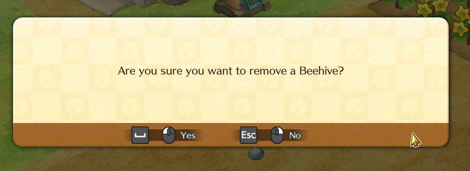

# Enhancements and Tweaks
A plugin/mod containing several additions and tweaks ("mods") to the game. It aims at improving the game experience (per mod-author own perspective).

All of its changes are configurable, so you may enable only the ones you want and even enabling them may allow you to further
customize it to your desires.

**Table of Contents:**
- [Installation](#installation)
- [List of mods](#list-of-mods)
	- [Adjust Tool Stamina](#adjust-tool-stamina)
		- [Reasoning](#reasoning)
	- [Alternative Furniture Rotation](#alternative-furniture-rotation)
	- [Confirm Beehive Removal](#confirm-beehive-removal)
	- [Event Alert](#event-alert)
	- [Map Shop Times](#map-shop-times)
	- [Show Item Price](#show-item-price)
	- [Sort Lists](#sort-lists)
		- [Configs](#configs)
	- [Stamina Bar](#stamina-bar)
- [Configuration](#configuration)
- [Building](#building)
- [Contributting](#contributting)


## Installation
**Requirements:**
You must have BepInEx v5 and kz Mod Utils installed on your game.
- [Download BepInEx v5](https://github.com/BepInEx/BepInEx/releases)
	- [How to install BepInEx](https://docs.bepinex.dev/articles/user_guide/installation/index.html)
- [kz Mod Utils page](../kzModUtils/)

After having them installed:
1. download the latest version of the mod dll from the [Releases](https://github.com/guilherme-gm/KirieZ_DoraemonSoSMods/releases) page
2. Extract its content into your game's `BepInEx/plugins/` folder
3. Start the game
4. **(Optional)** If you don't want to use the default settings, close the game and see [Configuration](#configuration)

---

## List of mods

### Adjust Tool Stamina
Makes every tool that consumes stamina always use 1, whatever the charge level is.

#### Reasoning
In the original game, improving the tool doesn't help much because although they cover a larger area,
the stamina consumption is the same as if you have used it several times. Thus, you just run out of stamina faster.

One could say this gives you more time for doing power naps, but in this case you just have to use technique endlessly
instead of enjoying the game. OR, if possible, you have to rush some gadget that does the work for you.

By making every charge level consume 1 stamina, you may aim at upgrading the tools you are using the most so
you spend less stamina doing your everyday stuff, having stamina for the rest of the day to do more.

Note that this change made Silver upgrade a bit weird, because it just charges faster. I did not touch it,
and just consider it as a "I can finish my work faster" upgrade.

---

### Alternative Furniture Rotation
<p align="center">
	
</p>

Changes how furniture placement works to provide a different rotation system.
1. It doesn't force the rotation to the character direction;
2. The objects have a different pivot now;
3. Adds a "Rotate" button so you can try different positioning from the same spot;
4. Adds a directional arrow to help determining direction of objects where direct matters (e.g.: Bed).

I won't call it as "better" because it is also not that fluid, but it is an alternative way that gives a bit more control / less side effects.

**Note:** This mod will probably conflict with other mods touch furniture placement, because it replaces the main rotation code.

---

### Confirm Beehive Removal
<p align="center">
	
</p>

Adds a dialog to confirm before you remove a placed beehive.

This prevents you from accidentally removing a beehive that has bees and end up losing Honey and Bees ( I did this several times :) )

---

### Event Alert
Displays an alert using the event log (the place where stamina status / item obtained / etc are displayed) when a festival is about to start.

---

### Map Shop Times
<p align="center">
	
</p>

Adds a new button to the minimap window to toggle a small extra window that shows shops working hours.

Shops in Doraemon SoS opens in weird times and different days, which is annoying to remember and you
usually will go for an external guide.

This mod simply adds a small window so you can check it in game.

---

### Show Item Price
<p align="center">
	
</p>

Adds a new box beside item description in inventory and storages UIs.
This box presents information about the price of the item when sold.

It includes the base price (0.5 star) and the current price, helping you keep track of how much you are
earning for those items/deciding what to sell.

Although the game provides a UI to keep track of gainings/losses, it is really hard to track individual
prices, specially when quality stars are added in the sum.

---

### Sort Lists
Sorts some in-game menu lists alphabetically instead of the "random" order they are originally in.
This make it easier to find what you are looking for.

Currently the following lists are supported (some are disabled by default, see Config on how to enable them):
- Kitchen's recipe list (default: sorted)
- Cafe's recipe shop (default: sorted)
- Cafe's produce shop (default: original / not sorted)
- Cafe's meals shop (default: original / not sorted)

If there is any other list that you feel the need to be sorted, let me know (or submit a PR!).

#### Configs
| Config Name         | Description                                 | Accepted Values | Default |
| ------------------- | ------------------------------------------- | --------------- | ------- |
| SortRecipeList      | Sort Kitchen's recipe list?                 | `true`/`false`  | `true`  |
| SortRecipeShopList  | Sort Cafet's Recipe Shop list?              | `true`/`false`  | `true`  |
| SortProduceShopList | Sort Cafet's Produce list (vegetables/etc)? | `true`/`false`  | `false` |
| SortMealsShopList   | Sort Cafet's Meals shop list (food shop)?   | `true`/`false`  | `false` |

---

### Stamina Bar
<p align="center">
	
</p>

Displays a small window below game's clock with your current stamina.

This removes the need to pause/open the game menu to check.

---

## Configuration

> **Note:** Using [BepInEx Configuration Manager](https://github.com/BepInEx/BepInEx.ConfigurationManager) to enable/disable mods won't work until you restart the game.
> For other settings it should work fine.

> **Note:** Before editting the config files, close the game.

After installing this mod and starting your game once, a config file will be generated at
`[install dir]/BepInEx/config/io.github.guilherme-gm.DoraemonSoSMods.enhancementsAndTweaks.cfg`.

Open this file and change the settings as you wish. The first section, `[Mod Enable]` will
cover configs to enable each of the mods supported by `Enhancements And Tweaks`.

To disable one mod (for example, `Adjust Tool Stamina`), simply search for the `Enable[ModName] = true` line. For example:
```
## Enable Adjust Tool Stamina.
## This will make every tool in the game that consumes stamina (e.g. Watering Can, Axe, ...)
## always consume 1, regardless of how much they were "charged".
# Setting type: Boolean
# Default value: true
EnableAdjustToolStamina = true <----- Here
```

After finding it, simply change `true` to `false` and save. The mod will be disabled.

Every other setting in this file works in a similar way, find the config, change it to the desired value (check each mod section above to know what each config does).

---

## Building
You will need Visual Studio 2019 and .NET Framework 3.5 installed.

1. Clone this repository
2. Copy Doraemon's `Assembly-CSharp.dll` into `libs` folder
3. Open the `Mods.sln` solution
4. Build it

---

## Contributting
See [CONTRIBUTTING.md](../CONTRIBUTTING.md).
