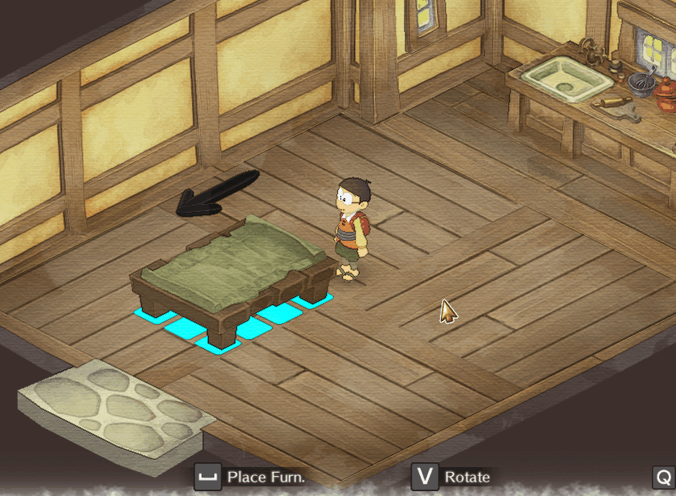
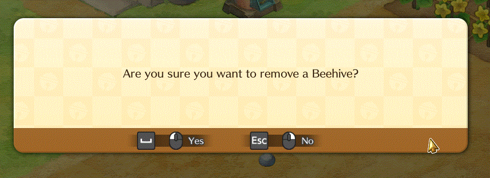
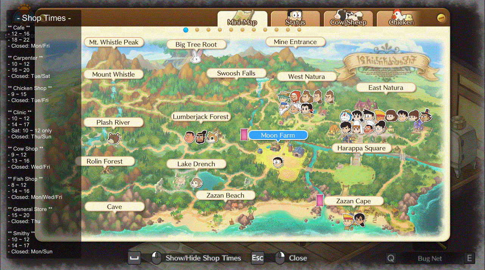
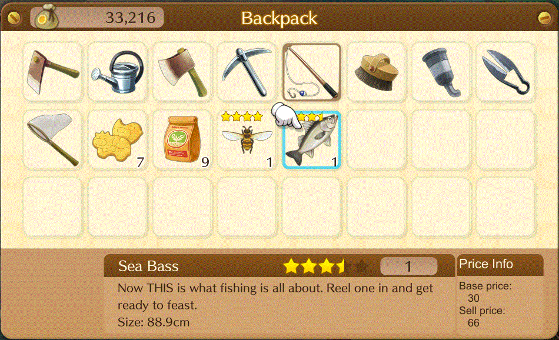
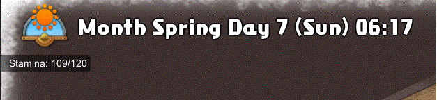
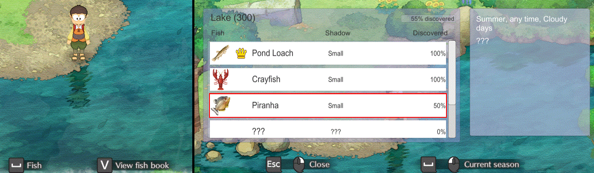

# KirieZ_DoraemonSoSMods
Mods for Doraemon Story of Seasons originally made by KirieZ (@guilherme-gm)

> **NOTE for old users:** If you are coming here after download mods in 2022, you may notice that there are several mods missing.
>
> They were NOT removed. Just merged into a single mod: Enhancements and Tweaks
>
> Please update your mod to it, as I will only keep this mod from now on. No functionality was lost.
> This is just a single mod that compiles all of them (and you may enable/disable them individually).
>

## List of mods

### Enhancements and Tweaks
This mod incorporates several Quality of Life and minor adjustments to the game to improve progression and general playing experience (in the mod-author's vision).
You are able to toggle each change separately to pick only the ones you want.

Summarized list of changes: (View [mod page](./EnhancementsAndTweaks/) for details)
- **(Adjustment)** Make tools consume 1 of stamina regardless of the charging level
- **(QoL)** Put a new system to rotate/place objects

	

- **(QoL)** Add a confirmation dialog before you remove a Beehive

	

- **(QoL)** Displays an alert using the event log when a festival is about to start
- **(QoL)** Adds a togglable window in mini-map menu to display shops working hours

	

- **(QoL)** Display item sell price beside item description

	

- **(QoL)** Sorts some lists menu alphabetically
- **(QoL)** Display player stamina below clock

	

### Fishbook
Adds a fishbook item to be bought. This item will track your progress as you catch fishes on the game and display info about each fishing spot when you get near them.

This mod is pretty much done, but still could use some visual improvements.

## kz Mod Utils

Library with utilities to make mods. The aim of this lib is to provide other mods a direct and consistent interface to do their work, so they don't have to rely on the game internals in case it ever changes.

It also helps solve conflicts between mods, for example, by providing a single and incremental item ID system that mods may extend.

## Dump Master
Utility to dump the binary resources as text. This is a prototype and quite unstable.

## Doramon Story of Seasons mod template settings
- TFM: net35
- Unity version: 2017.4.10

## Building
To build those mods yourself you will need .NET Framework installed (per BepInEx dependency) and Visual Studio.

After having those pre-requisites:
1. Clone this repository
2. Copy `Assembly-CSharp.dll` and `UnityEngine.UI.dll` from your Doraemon Story of Seasons folder (path: `[SteamApps folder]/DORAEMON STORY OF SEASONS/DORaEMON STORY OF SEASONS_Data/Managed/`) into `libs` folder in this cloned repository.
3. Open `Mods.sln` and wait until it gets additional dependencies via NuGet
4. You are ready to click on "Build"

Similar steps may work for VSCode, but I am not sure how to download NuGet packages there.

## Issues
If you have found any issue, consider opening an Issue and stating as much details as possible.

## Contributting
See [Contributting](./CONTRIBUTTING.md).
