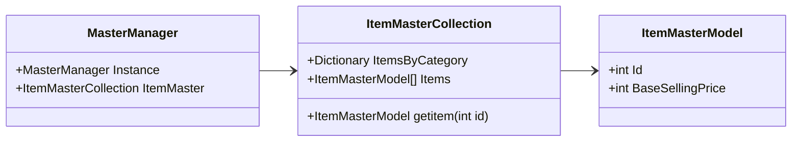

Master collections are a set of structures that stores game's static data. That is,
base data that defines how items, animals, objects, events, etc. should behave.

For example, Item-related master collections will define that item ID "1" is a stone,
that is a building material, that stacks, that is called "Stone", that is sold for
a given amount of gold, etc. This is not the item that you obtain in game, but the
general data that defines every instance of that item.

These values are stored in files in the game assets, but during the game startup,
those files are loaded into several `Dictionary` structures.

Most of the time (if not always) the loading happens in 4 steps
(`*` means the structure name -- e.g. Item, Tool, Animal, and so on):

1. The file elements are loaded into `C*Data` instances
2. `C*Data` elements are mapped to `*MasterModel` instances
3. Each `*MasterModel` instance is added to `*MasterCollection`
4. `*MasterCollection` is referenced in `MasterManager`

For example, basic item data is loaded into `CItemData`, which is then mapped to
`ItemMasterModel` and the list of those are loaded in `ItemMasterCollection`.
`ItemMasterCollection` will be referenced at `MasterManager.ItemMasterCollection`.

Fetching static data should be made through `MasterManager`, from there
you can reach out to the desired Master Collection.

This is a simplified diagram illustrating the relationship. Note that `MasterManager` is a singleton.

## DumpMaster plugin
You can build and use [DumpMaster](https://github.com/guilherme-gm/KirieZ_DoraemonSoSMods/tree/master/DumpMaster) plugin in order to get CSV files from all those collections.

Simply follow the instructions in the repository readme file.

## List of master models
This sections aims to document what each of the many models means.
This is certainly not a complete list and was done in a best effort/as it was found
case. Feel free to contribute additions to it.

| Data name                 | Model name             | Description                                                                            | Master collection name      |
| ------------------------- | ---------------------- | -------------------------------------------------------------------------------------- | --------------------------- |
| CAchievementData          | AchievementMasterModel |                                                                                        | AchievementMasterCollection |
| CAnimalData               |                        |                                                                                        |                             |
| CAnimalText               |                        |                                                                                        |                             |
| CAreaData                 |                        |                                                                                        |                             |
| CBgmData                  |                        |                                                                                        |                             |
| CBgmText                  |                        |                                                                                        |                             |
| CBugData                  |                        |                                                                                        |                             |
| CBugPointData             |                        |                                                                                        |                             |
| CBugRaceData              |                        |                                                                                        |                             |
| CBuildingData             |                        |                                                                                        |                             |
| CBuildingShopData         |                        |                                                                                        |                             |
| CBuildingText             |                        |                                                                                        |                             |
| CCarnivalData             |                        |                                                                                        |                             |
| CCarnivalInfoText         |                        |                                                                                        |                             |
| CCarnivalTitleText        |                        |                                                                                        |                             |
| CCattleAndSheepShopData   |                        |                                                                                        |                             |
| CCharacterData            |                        |                                                                                        |                             |
| CCharacterResponsePresent |                        |                                                                                        |                             |
| CCharacterResponseTalk    |                        |                                                                                        |                             |
| CCharacterText            |                        |                                                                                        |                             |
| CChickenShopData          |                        |                                                                                        |                             |
| CCommandText              |                        |                                                                                        |                             |
| CCommonUIText             |                        |                                                                                        |                             |
| CCookingRecipeData        |                        |                                                                                        |                             |
| CCookingToolData          |                        |                                                                                        |                             |
| CCropData                 |                        |                                                                                        |                             |
| CDigPointData             |                        |                                                                                        |                             |
| CDolphinItemData          |                        |                                                                                        |                             |
| CEndRoll01Data            |                        |                                                                                        |                             |
| CEndRoll02Data            |                        |                                                                                        |                             |
| CEndRollText              |                        |                                                                                        |                             |
| CEventData                | EventMasterModel       | Main definition of game [events](./Events.md), like cutscenes.                         | EventMasterCollection       |
| CEventGroupData           | EventGroupMasterModel  | Defines group names for [events](./Events.md) (linked to the tabs in the time machine) | EventMasterCollection       |
| CEventText                | TextMasterModel        |                                                                                        | EventMasterCollection       |
| CEventTitleText           | TextMasterModel        | Contains the name of the [event](./Events.md), for example, for time machine.          |                             |
| CExchangeItemData         |                        |                                                                                        |                             |
| CFishData                 |                        |                                                                                        |                             |
| CFishingPoint             |                        |                                                                                        |                             |
| CFishingPointData         |                        |                                                                                        |                             |
| CFishingTackleShopData    |                        |                                                                                        |                             |
| CFurnitureCategoryData    |                        |                                                                                        |                             |
| CFurnitureData            |                        |                                                                                        |                             |
| CFurnitureGimmickTypeData |                        |                                                                                        |                             |
| CFurnitureShopData        |                        |                                                                                        |                             |
| CFurnitureTypeData        |                        |                                                                                        |                             |
| CGatheringData            |                        |                                                                                        |                             |
| CGatheringGroupData       |                        |                                                                                        |                             |
| CHospitalShopData         |                        |                                                                                        |                             |
| CItemData                 |                        |                                                                                        |                             |
| CItemText                 |                        |                                                                                        |                             |
| CKorobokkurShopData       |                        |                                                                                        |                             |
| CMakerShopData            |                        |                                                                                        |                             |
| CMapData                  |                        |                                                                                        |                             |
| CMapText                  |                        |                                                                                        |                             |
| CMaterialShopData         |                        |                                                                                        |                             |
| CMineData                 |                        |                                                                                        |                             |
| CMineFloorData            |                        |                                                                                        |                             |
| CMineItemData             |                        |                                                                                        |                             |
| CMineralShopData          |                        |                                                                                        |                             |
| CMiniGameTutorialData     |                        |                                                                                        |                             |
| CMiniGameTutorialText     |                        |                                                                                        |                             |
| CNarrationText            |                        |                                                                                        |                             |
| CObstacleData             |                        |                                                                                        |                             |
| CObstacleText             |                        |                                                                                        |                             |
| CQuestData                |                        |                                                                                        |                             |
| CQuestItemData            |                        |                                                                                        |                             |
| CRestaurantShopData       |                        |                                                                                        |                             |
| CRestrictionMapData       |                        |                                                                                        |                             |
| CRewardEventData          |                        |                                                                                        |                             |
| CSignText                 |                        |                                                                                        |                             |
| CTalkText                 |                        |                                                                                        |                             |
| CTodaysWordData           |                        |                                                                                        |                             |
| CTodaysWordText           |                        |                                                                                        |                             |
| CToolData                 |                        |                                                                                        |                             |
| CUIText                   |                        |                                                                                        |                             |
| CUpgradeToolShopData      |                        |                                                                                        |                             |
| CVarietyShopData          |                        |                                                                                        |                             |
| CWeatherData              |                        |                                                                                        |                             |
